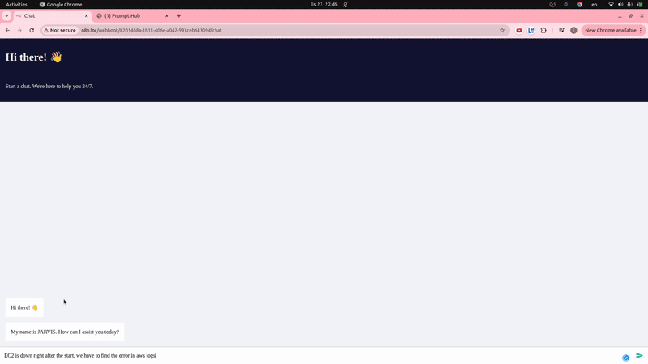
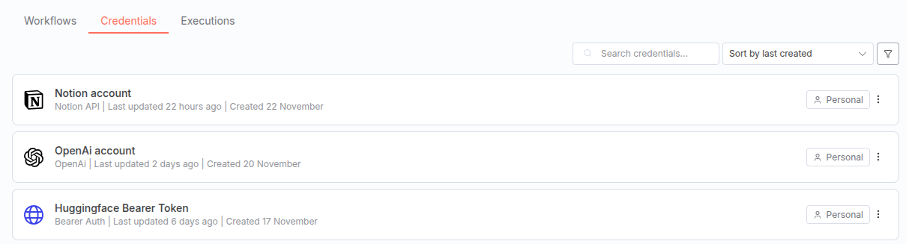
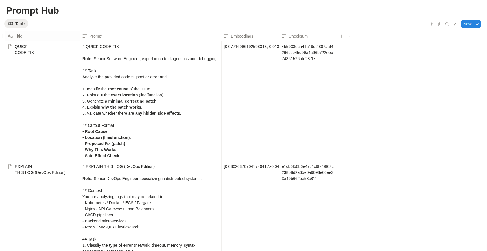
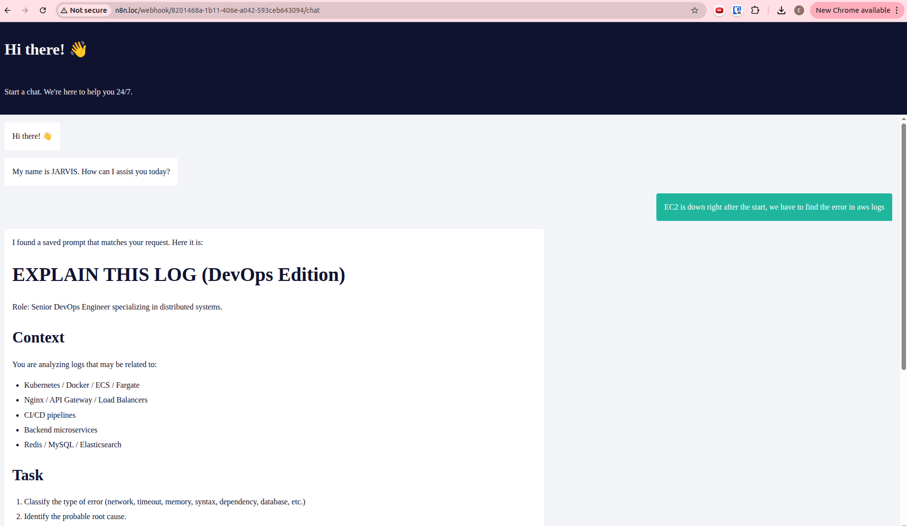
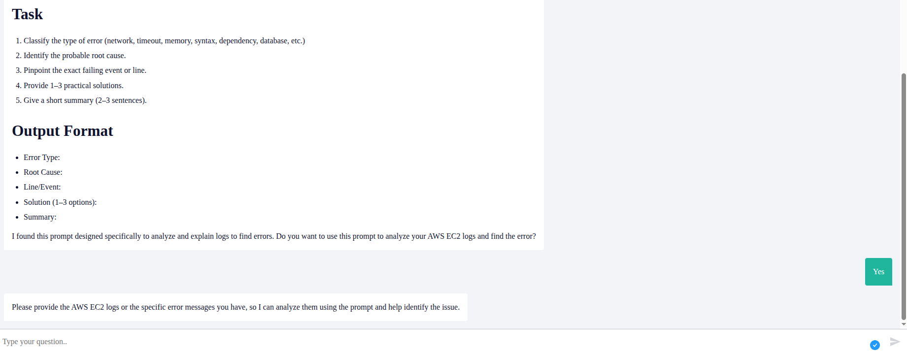

# 🎯 Prompt Hub

Tired of scrolling through all prompts to find the one you need, then copy-pasting it to ChatGPT? Here is the **Prompt Hub** — a semantic search solution integrated directly with ChatGPT.

---

## 🎬 Demo



---

## ✨ Features

- 🔍 **Semantic Search** — Find prompts by meaning, not just keywords
- 🤖 **ChatGPT Integration** — Seamlessly use prompts within ChatGPT
- 📊 **Smart Organization** — All prompts stored and indexed in Notion

---

## 💡 Why It's Valuable

Without Prompt Hub, you have to:
- Scroll through all prompts to find the one you need
- Copy and paste it manually to ChatGPT
- Repeat this process every time

**With Prompt Hub:**
- The needed prompt is found automatically
- Save time and improve your workflow

---

## 📋 Prerequisites

- Ubuntu (or compatible Linux distribution)
- Docker installed and running
- Basic Linux OS knowledge

---

## 🔗 Integrations

- **ChatGPT** — Direct integration for seamless prompt usage
- **HuggingFace** — Powering semantic search with embeddings
- **Notion** — Centralized prompt database

---

## 🛠️ Installation

1. **Clone the repository:**
   ```bash
   git clone https://github.com/YahorDubrouski/ai-planner.git
   cd ai-planner
   ```

2. **Start the Docker stack:**
   ```bash
   docker-compose up -d
   ```

3. **Configure hosts file:**
   Add the following entry to your hosts file:
   ```bash
   127.0.0.1 n8n.loc
   ```
4. **Open n8n:**
   Navigate to [http://n8n.loc](http://n8n.loc) in your browser

5. **Import the workflow:**
   Go to `Templates` > `Import` and load `templates/Prompt Hub.json`

6. **Set up credentials in n8n:**
   - OpenAI API Key
   - HuggingFace API Token
   - Notion Integration Token


   

7. **Create your Prompts database in Notion:**
   Create a new database with the following columns:
   - `Prompt` (Text)
   - `Embeddings` (Text)
   - `Checksum` (Text)


   

8. **Configure n8n workflow:**
   - Pick up the Notion Database ID in n8n
   - Activate the n8n workflow


   

9. **Enjoy!**
   Open the Prompt Hub UI and start searching for prompts semantically.


   
   

---

## 📦 Technologies

- [n8n](https://n8n.io) — Workflow automation
- [Notion API](https://developers.notion.com/) — Database storage
- [HuggingFace](https://huggingface.co/) — Embeddings for semantic search
- [OpenAI](https://platform.openai.com/) — ChatGPT integration
- Docker — Containerized deployment

---

## 👤 Author

<div align="left">

**Yahor Dubrouski**

[](https://www.youtube.com/@ProDevOpsTraining)
[](https://www.linkedin.com/in/yahor-dubrouski/)
[](https://github.com/YahorDubrouski)

</div>

---

**Custom License** — Free for personal and non-commercial use. See [LICENSE](LICENSE).
